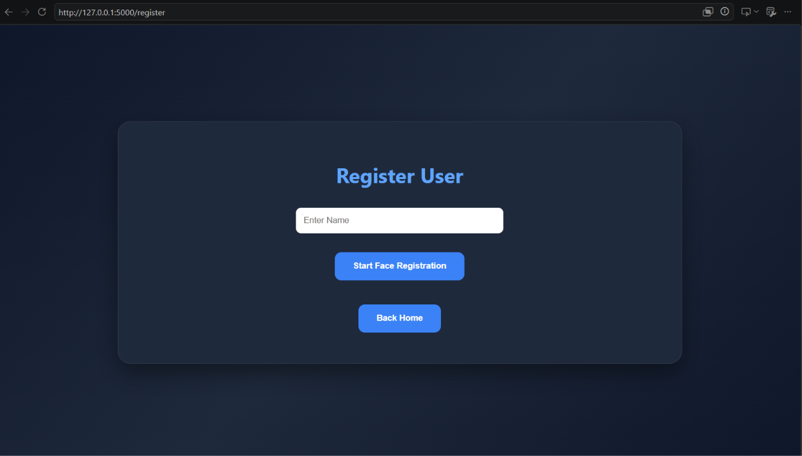
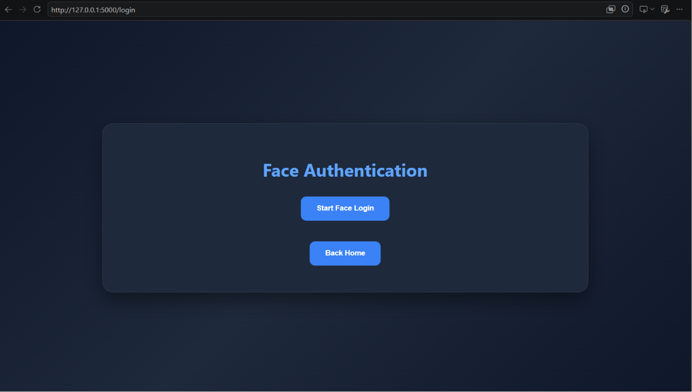
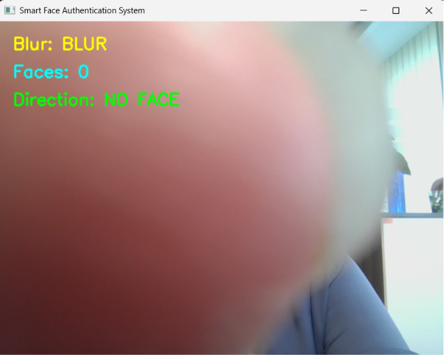
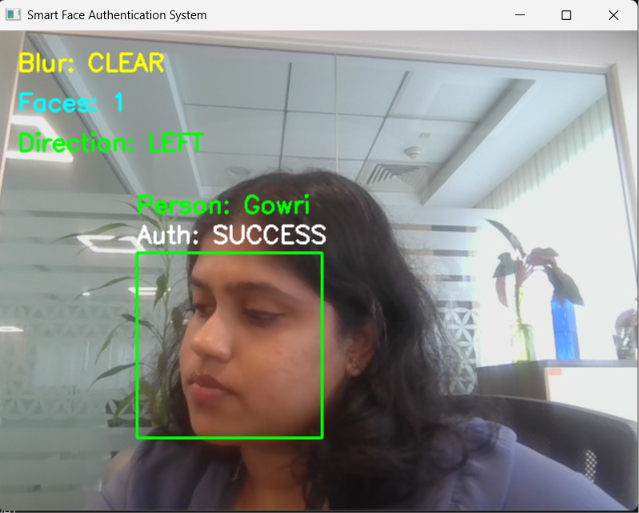
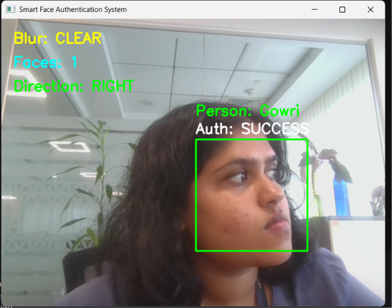
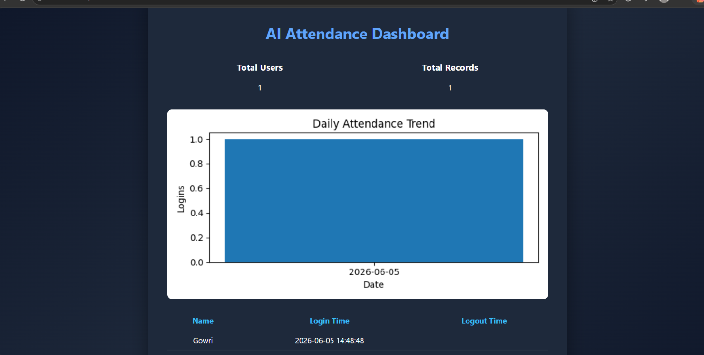

# 🎭 Smart Face Authentication System

An AI-powered Smart Face Authentication and Attendance Management System developed using Python, Flask, OpenCV, Face Recognition, and YOLOv8.

The system enables secure facial authentication, attendance tracking, blur detection, face direction analysis, and real-time monitoring through a user-friendly web dashboard.

---

# 🚀 Features

✅ Face Registration

✅ Face Recognition Authentication

✅ Automated Attendance Management

✅ Login & Logout Tracking

✅ Blur Detection

✅ Face Direction Detection (Left / Right / Center)

✅ Face Count Detection

✅ Multiple Face Detection Prevention

✅ Real-Time Webcam Monitoring

✅ Attendance Dashboard

✅ Attendance Analytics & Graphs

✅ Excel Attendance Report Download

✅ AI-Powered Authentication

✅ YOLOv8 Object Detection Integration

---

# 🛠️ Technologies Used

## Frontend

* HTML5
* CSS3
* JavaScript

## Backend

* Python
* Flask

## Artificial Intelligence & Computer Vision

* OpenCV
* Face Recognition Library
* YOLOv8
* Facial Encoding & Matching
* Real-Time Image Processing
* Face Detection & Tracking

## Data Handling

* CSV
* Pandas
* Matplotlib

---

# 🧠 System Modules

### Face Registration

Allows new users to register their facial data by capturing multiple images through the webcam.

### Face Authentication

Authenticates registered users using facial recognition technology.

### Blur Detection

Evaluates image quality and identifies blurry frames before authentication.

### Face Direction Detection

Tracks face movement and orientation.

* Left Detection
* Right Detection
* Center Detection

### Attendance Management

Automatically records:

* User Name
* Login Time
* Logout Time

### Dashboard Analytics

Displays:

* Total Users
* Attendance Records
* Attendance Trends
* Downloadable Reports

### YOLOv8 Integration

YOLOv8 is utilized as part of the computer vision pipeline to support advanced object and person detection capabilities, enhancing system scalability for future security and surveillance applications.

---

# 📂 Project Structure

```text
FaceAuthSystem/
│
├── app.py
│
├── dataset/
│   ├── User1/
│   ├── User2/
│
├── logs/
│   ├── attendance.csv
│   ├── attendance.xlsx
│
├── src/
│   ├── register.py
│   ├── recognize.py
│   ├── blur.py
│   ├── pose.py
│
├── static/
│   ├── style.css
│   ├── graph.png
│
├── templates/
│   ├── index.html
│   ├── register.html
│   ├── login.html
│   ├── attendance.html
│
├── screenshots/
│   ├── home.png
│   ├── register.png
│   ├── login.png
│   ├── blur_detection.png
│   ├── left_detection.png
│   ├── right_detection.png
│   ├── dashboard.png
│
└── README.md
```

---

# 📸 Screenshots

## Home Page


---

## User Registration



---

## Face Authentication



---

## Blur Detection



---

## Left Face Detection



---

## Right Face Detection



---

## Attendance Dashboard



---

# 🎥 Demo Video

Complete project demonstration:

**Demo Video Link:**
PASTE_YOUR_SCREEN_RECORDING_LINK_HERE

Example:

https://drive.google.com/file/d/xxxxxxxxxxxxxxxx

---

# 🌐 Live Website

Project URL:

PASTE_YOUR_WEBSITE_LINK_HERE

Example:

https://your-project.onrender.com

---

# ⚙️ Installation

## Clone Repository

```bash
git clone https://github.com/gowrinandana21/Smart-Face-Authentication-System.git
```

## Navigate to Project Folder

```bash
cd Smart-Face-Authentication-System
```

## Install Required Packages

```bash
pip install flask
pip install opencv-python
pip install face-recognition
pip install pandas
pip install matplotlib
pip install ultralytics
```

## Run Application

```bash
python app.py
```

Open:

```text
http://127.0.0.1:5000
```

---

# 📈 Workflow

1. Register User
2. Capture Face Images
3. Store Facial Dataset
4. Authenticate User
5. Verify Face Quality
6. Detect Face Direction
7. Record Attendance
8. Generate Dashboard Analytics
9. Export Attendance Reports

---

# 🔒 Security Features

* Face-Based Authentication
* Blur Detection
* Multi-Face Prevention
* Attendance Audit Trail
* Real-Time Monitoring
* Secure Attendance Logging

---

# 📊 Project Outcomes

* Reduced manual attendance effort
* Improved authentication accuracy
* Enhanced attendance tracking
* Real-time facial verification
* User-friendly dashboard experience

---

# 🔮 Future Enhancements

* Advanced YOLOv8 Analytics
* Face Liveness Detection
* Mobile Application
* Cloud Database Integration
* Admin Management Panel
* Email Notifications
* Face Mask Detection
* Visitor Management System
* Real-Time Surveillance Dashboard

---

# 👩‍💻 Author

**Gowri Nandana**

B.Tech Computer Science and Business Systems

Model Engineering College, Kerala

---

